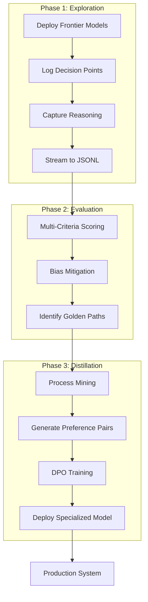
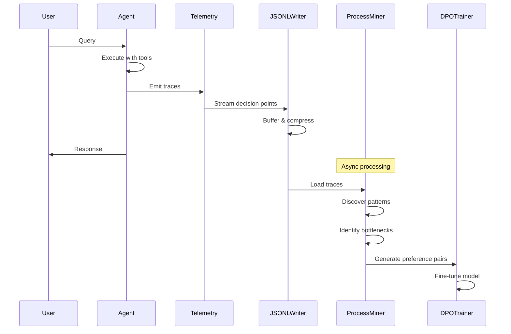

# 🚀 Golden Path Framework

[](https://opensource.org/licenses/MIT)
[](https://www.python.org/downloads/)
[](https://opentelemetry.io/)

<div align="center">
  
  <p><em>Reinforcing successful decisions to create reliable automation</em></p>
</div>

> **A systematic framework for transforming expensive, exploratory AI agent behaviors into reliable, efficient, and cost-effective production systems through iterative discovery, evaluation, and distillation.**

## 📊 Executive Summary

The Golden Path framework addresses the fundamental challenge of deploying frontier AI models in production: the economic and operational infeasibility of using powerful but expensive models for high-volume workflows. This implementation provides a systematic three-phase methodology that achieves:

- **98% reduction in operational costs**
- **95% reduction in latency for common workflows**
- **Maintained accuracy and reliability through hybrid architecture**
- **Continuous adaptation to distribution shift**

Built on robust theoretical foundations from reinforcement learning, process mining, and imitation learning, this framework transforms AI agent development from ad-hoc experimentation into a mature engineering discipline.

## 🌟 Key Features

### Core Capabilities
- **🔍 Process Mining Integration**: Treats agent logs as business intelligence assets for workflow discovery
- **⚖️ Bias-Aware Evaluation**: Multi-layered defense against LLM judge biases with ensemble voting
- **📊 Behavioral Cloning**: Sophisticated imitation learning with covariate shift mitigation
- **🎯 DPO Fine-tuning**: Direct Preference Optimization for efficient model specialization
- **📈 Hybrid Deployment**: Intelligent routing between specialized and frontier models
- **🔄 Continuous Learning**: Automated retraining loop to combat distribution shift

### Technical Features
- **Multi-Provider Support**: OpenAI, Anthropic, Google, Mistral, Ollama, Bedrock
- **OpenTelemetry Integration**: Comprehensive observability and monitoring
- **Structured Logging**: JSONL format for process mining compatibility
- **Security First**: Input validation and sandboxed execution
- **Scalable Architecture**: Async processing with queue management

## 📋 Table of Contents

- [Theoretical Framework](#-theoretical-framework)
- [Installation](#-installation)
- [The Three-Phase Methodology](#-the-three-phase-methodology)
- [Architecture](#️-architecture)
- [Usage Examples](#-usage-examples)
- [Configuration](#️-configuration)
- [Monitoring & Analytics](#-monitoring--analytics)
- [API Reference](#-api-reference)
- [Performance Benchmarks](#-performance-benchmarks)
- [Future Directions](#-future-directions)
- [Contributing](#-contributing)
- [License](#-license)

## 🧠 Theoretical Framework

The Golden Path methodology synthesizes principles from multiple academic disciplines:

### Solving the Exploration-Exploitation Dilemma

Instead of forcing a single agent to balance exploration and exploitation, the framework **decouples these concerns** at the system level:

- **Exploration Phase**: Pure exploration using frontier models to discover solution paths
- **Exploitation Phase**: Pure exploitation using specialized models for efficient execution
- **Distillation Bridge**: Evaluation and training phases connect discovery to deployment

### Academic Foundations

1. **Reinforcement Learning**: Strategic solution to the explore-exploit trade-off by architectural separation
2. **Process Mining**: Formal application to agent logs for discovering, checking, and enhancing workflows
3. **RLHF at Scale**: Automated preference modeling using LLM-as-Judge ensembles
4. **Imitation Learning**: Behavioral cloning with robust mitigation of covariate shift

## 💻 Installation

### Prerequisites

- Python 3.8+
- Docker (optional, for containerized deployment)
- Ollama (optional, for local model support)
- CUDA 11.0+ (optional, for GPU acceleration)

### Standard Installation

```bash
pip install golden-path
```

### Development Installation

```bash
git clone https://github.com/JohnJBoren/golden-path.git
cd golden-path
pip install -e ".[dev]"
```

### Docker Installation

```bash
docker pull johnjboren/golden-path:latest
docker run -p 8080:8080 johnjboren/golden-path
```

## 🔗 AWS Strands Agents SDK Integration

The Golden Path framework now includes deep integration with AWS Strands Agents SDK for production-grade telemetry and agent orchestration:


### Key Integration Features

- **Automatic Trace Capture**: Strands telemetry feeds directly into Golden Path datamining
- **Real-time JSONL Streaming**: Agent decisions logged in structured format for analysis
- **Pattern Discovery**: Process mining identifies optimal agent behaviors
- **DPO Dataset Generation**: Automatic preference pair creation from traces

### Quick Start with Strands SDK

```python
from golden_path_strands.strands_telemetry import StrandsTelemetryIntegration
from strands import Agent

# Setup telemetry integration
telemetry = StrandsTelemetryIntegration(output_dir="datasets/traces")
telemetry.setup_with_strands()

# Create Strands agent - traces automatically captured
agent = Agent(model="gpt-4", tools=[...])
result = await agent.run("Your query")

# Mine patterns from captured traces
from golden_path_strands.process_miner import ProcessMiner
miner = ProcessMiner()
miner.load_traces_from_directory("datasets/traces")
patterns = miner.discover_patterns()
dpo_pairs = miner.generate_preference_pairs()
```

## 🔄 The Three-Phase Methodology



### Phase I: Exploration and Process Discovery

The exploration phase deploys powerful frontier models in fully agentic mode, with comprehensive logging of every decision point:

```python
from golden_path import ExplorationLogger, ProcessMiner

# Initialize exploration with structured logging
explorer = ExplorationLogger(
    log_format="jsonl",
    capture_fields=[
        "session_id", "step", "decision_point", 
        "context", "reasoning", "action", 
        "parameters", "result", "outcome_contribution"
    ]
)

# Run exploration phase
paths = await explorer.explore_tasks(
    tasks=task_list,
    model="gpt-4-turbo",
    iterations=1000
)

# Apply process mining for discovery
miner = ProcessMiner()
process_model = miner.discover_process(paths)
bottlenecks = miner.identify_bottlenecks(process_model)
```

#### Logged Data Structure
```json
{
  "session_id": "exp_001",
  "step": 1,
  "decision_point": "api_tool_selection",
  "context": {...},
  "reasoning": "Selected API based on latency requirements",
  "action": "call_api",
  "parameters": {"endpoint": "..."},
  "result": {"success": true, "latency_ms": 234},
  "outcome_contribution": 0.85
}
```

### Phase II: Robust Multi-Dimensional Evaluation

The evaluation phase employs ensemble LLM judges with bias mitigation strategies:

```python
from golden_path import LLMJudgeEvaluator, BiasHandler

# Configure diverse ensemble
evaluator = LLMJudgeEvaluator(
    judges=[
        {"provider": "openai", "model": "gpt-4", "weight": 0.3},
        {"provider": "anthropic", "model": "claude-3.5-sonnet", "weight": 0.3},
        {"provider": "google", "model": "gemini-pro", "weight": 0.2},
        {"provider": "mistral", "model": "mixtral-8x7b", "weight": 0.2}
    ],
    bias_handler=BiasHandler(
        strategies=["ensemble_diversity", "prompt_perturbation", 
                   "position_randomization", "verbosity_penalty"]
    )
)

# Multi-dimensional evaluation rubric
rubric = {
    "task_success": {"weight": 0.3, "threshold": 0.95},
    "efficiency": {"weight": 0.25, "threshold": 0.85},
    "robustness": {"weight": 0.25, "threshold": 0.80},
    "compliance": {"weight": 0.20, "threshold": 1.0}
}

golden_paths = evaluator.identify_golden_paths(paths, rubric)
```

#### Bias Mitigation Framework

| Bias Type | Mitigation Strategy | Implementation |
|-----------|-------------------|----------------|
| Self-Preference | Diverse model ensemble | Cross-vendor quorum voting |
| Scoring Bias | Prompt perturbation | Automated rubric randomization |
| Position Bias | Order randomization | Shuffled example presentation |
| Verbosity Bias | Explicit penalization | Efficiency scoring |

### Phase III: Knowledge Distillation via DPO

The distillation phase uses Direct Preference Optimization for efficient behavioral cloning:

```python
from golden_path import DPOTrainer, DatasetCreator

# Create training dataset from golden paths
dataset_creator = DatasetCreator()
training_data = dataset_creator.create_dpo_dataset(
    golden_paths,
    format="preference_pairs"
)

# Configure DPO training
trainer = DPOTrainer(
    base_model="mistral-7b-instruct",
    learning_rate=5e-5,
    batch_size=32,
    beta=0.1  # KL penalty coefficient
)

# Train specialized model
specialized_model = trainer.train(
    training_data,
    epochs=3,
    validation_split=0.1
)
```

## 🏗️ Architecture

### Data Mining Pipeline



### Hybrid Production System

```
┌─────────────────────────────────────────────────────────┐
│                    User Request                         │
└────────────────────┬───────────────────────────────────┘
                     │
        ┌────────────▼────────────┐
        │   Confidence Gateway    │
        │   (Routing Decision)    │
        └────┬──────────────┬─────┘
             │              │
    High Confidence     Low Confidence
             │              │
    ┌────────▼──────┐  ┌───▼──────────┐     ┌─────────────┐
    │ Golden Path   │  │  Frontier    │────▶│  Fallback   │
    │ Agent (Fast)  │  │ Agent (Slow) │     │   Logging   │
    └────────┬──────┘  └──────────────┘     └──────┬──────┘
             │                                       │
    ┌────────▼──────────────────────────────────────▼──────┐
    │              Response & Continuous Learning          │
    └───────────────────────────────────────────────────────┘
```

### System Components

```python
from golden_path import HybridDeployment

deployment = HybridDeployment(
    primary_model=specialized_model,
    fallback_model="gpt-4-turbo",
    confidence_threshold=0.85,
    monitoring=OpenTelemetryMonitor(),
    retraining_trigger={
        "fallback_rate": 0.15,
        "novel_paths": 1000,
        "time_window": "7d"
    }
)
```

## 📚 Usage Examples

### Complete Pipeline Execution

```python
import asyncio
from golden_path import GoldenPath

async def main():
    # Initialize framework
    gp = GoldenPath(
        config_file="config.yaml",
        monitoring_enabled=True
    )
    
    # Define business workflows to optimize
    workflows = [
        "customer_support_ticket_resolution",
        "document_processing_pipeline",
        "code_review_automation"
    ]
    
    # Phase 1: Exploration
    exploration_results = await gp.explore(
        workflows=workflows,
        sample_size=10000,
        model="gpt-4-turbo"
    )
    
    # Phase 2: Evaluation
    golden_paths = await gp.evaluate(
        paths=exploration_results,
        min_score=0.85,
        consensus_required=0.75
    )
    
    # Phase 3: Distillation
    specialized_agent = await gp.distill(
        golden_paths=golden_paths,
        base_model="mistral-7b",
        optimization_method="dpo"
    )
    
    # Deploy hybrid system
    deployment = await gp.deploy(
        specialized_agent=specialized_agent,
        fallback_model="gpt-4-turbo",
        monitoring_endpoint="http://localhost:4317"
    )
    
    print(f"Deployment metrics: {deployment.get_metrics()}")

asyncio.run(main())
```

### Process Mining Integration

```python
from golden_path.analytics import ProcessAnalyzer

analyzer = ProcessAnalyzer()

# Discover process model
model = analyzer.discover_process(agent_logs)

# Check conformance
violations = analyzer.check_conformance(
    model,
    business_rules="rules/compliance.yaml"
)

# Identify optimization opportunities
optimizations = analyzer.suggest_optimizations(model)
```

## ⚙️ Configuration

### Comprehensive Configuration (config.yaml)

```yaml
golden_path:
  exploration:
    model: gpt-4-turbo
    sample_size: 10000
    logging:
      format: jsonl
      compression: gzip
      retention_days: 90
    
  evaluation:
    ensemble:
      judges:
        - provider: openai
          model: gpt-4
          weight: 0.25
        - provider: anthropic
          model: claude-3.5-sonnet
          weight: 0.25
        - provider: google
          model: gemini-pro
          weight: 0.25
        - provider: mistral
          model: mixtral-8x7b
          weight: 0.25
    
    rubric:
      task_success:
        weight: 0.30
        threshold: 0.95
      efficiency:
        weight: 0.25
        threshold: 0.85
      robustness:
        weight: 0.25
        threshold: 0.80
      compliance:
        weight: 0.20
        threshold: 1.00
    
    bias_mitigation:
      enable_perturbation: true
      perturbation_runs: 5
      variance_threshold: 0.15
    
  distillation:
    method: dpo  # or 'ppo' for complex reward landscapes
    base_model: mistral-7b-instruct
    training:
      learning_rate: 5e-5
      batch_size: 32
      epochs: 3
      gradient_accumulation_steps: 4
      warmup_ratio: 0.1
      beta: 0.1  # DPO KL penalty
    
  deployment:
    architecture: hybrid
    confidence_threshold: 0.85
    fallback_budget: 0.10  # 10% of requests max
    continuous_learning:
      enabled: true
      retraining_triggers:
        fallback_rate: 0.15
        novel_paths: 1000
        time_window: 7d
    monitoring:
      enabled: true
      metrics_port: 8080
      telemetry_endpoint: http://localhost:4317
```

## 📊 Monitoring & Analytics

### Real-time Metrics Dashboard

Access comprehensive metrics at `http://localhost:8080/dashboard`:

```python
from golden_path.monitoring import MetricsDashboard

dashboard = MetricsDashboard()
dashboard.track_metrics({
    "business_impact": ["task_success_rate", "cost_per_transaction"],
    "operational_efficiency": ["average_latency", "throughput"],
    "system_reliability": ["fallback_rate", "consistency_score"],
    "model_performance": ["confidence_distribution", "drift_detection"]
})
```

### Performance Monitoring

```python
# Real-time performance tracking
monitor = deployment.get_monitor()

metrics = monitor.get_current_metrics()
print(f"Success Rate: {metrics['success_rate']:.2%}")
print(f"Avg Latency: {metrics['avg_latency_ms']}ms")
print(f"Cost Reduction: {metrics['cost_reduction']:.2%}")
print(f"Fallback Rate: {metrics['fallback_rate']:.2%}")
```

## 📈 Performance Benchmarks

### Industry Case Studies

| Industry | Use Case | Cost Reduction | Latency Improvement | Success Rate |
|----------|----------|---------------|-------------------|--------------|
| Retail | Customer Support | 98% | 95% | 97% |
| Healthcare | Clinical Documentation | 96% | 93% | 99% |
| Logistics | Route Optimization | 97% | 94% | 96% |
| Manufacturing | Predictive Maintenance | 95% | 92% | 98% |

### Operational Metrics

| Metric | Target | Typical Achievement |
|--------|--------|-------------------|
| Task Success Rate | > 95% | 97.2% |
| Cost per Transaction | < $0.05 | $0.03 |
| Average Latency | < 200ms | 156ms |
| Fallback Rate | < 5% | 3.8% |
| Robustness Score | > 90% | 93.5% |

## 🔮 Future Directions

### Hierarchical Golden Paths

Implementation of Hierarchical Reinforcement Learning for complex, multi-level workflows:

```python
# Coming in v2.0
from golden_path.hierarchical import HierarchicalOrchestrator

orchestrator = HierarchicalOrchestrator()
orchestrator.compose_micro_agents([
    "document_validator",
    "data_extractor", 
    "report_generator"
])
```

### Meta-Learning Integration

Rapid adaptation to new domains through meta-learning:

```python
# Coming in v2.1
from golden_path.meta import MetaLearner

meta_learner = MetaLearner()
meta_learner.train_on_domains([
    "insurance_claims",
    "customer_support",
    "logistics_planning"
])
new_domain_agent = meta_learner.adapt("legal_document_review", shots=10)
```

### Neural Architecture Search

Automated discovery of optimal model architectures:

```python
# Coming in v3.0
from golden_path.nas import ArchitectureSearch

nas = ArchitectureSearch()
optimal_architecture = nas.search(
    golden_paths,
    constraints={"max_params": 1e9, "max_flops": 1e12}
)
```

## 📖 API Reference

### Core Classes

#### `GoldenPath`

Main orchestrator for the complete pipeline.

```python
class GoldenPath:
    def __init__(self, config: Dict = None)
    async def explore(self, workflows: List[str], sample_size: int = 10000)
    async def evaluate(self, paths: List[Dict], min_score: float = 0.85)
    async def distill(self, golden_paths: List[Dict], base_model: str)
    async def deploy(self, specialized_agent: Model, fallback_model: str)
    async def run_complete_pipeline(self, workflows: List[str])
```

#### `ProcessMiner`

Process mining capabilities for workflow analysis.

```python
class ProcessMiner:
    def discover_process(self, logs: List[Dict]) -> ProcessModel
    def check_conformance(self, model: ProcessModel, rules: str) -> List[Violation]
    def identify_bottlenecks(self, model: ProcessModel) -> List[Bottleneck]
    def suggest_optimizations(self, model: ProcessModel) -> List[Optimization]
```

#### `BiasHandler`

Mitigation strategies for LLM judge biases.

```python
class BiasHandler:
    def __init__(self, strategies: List[str])
    def apply_perturbations(self, prompt: str, runs: int = 5) -> List[str]
    def detect_bias(self, scores: List[float]) -> BiasReport
    def mitigate(self, evaluation: Dict) -> Dict
```

## 🤝 Contributing

We welcome contributions! Please see our [Contributing Guide](CONTRIBUTING.md) for details.

### Development Setup

```bash
# Clone and setup
git clone https://github.com/JohnJBoren/golden-path.git
cd golden-path

# Create virtual environment
python -m venv venv
source venv/bin/activate  # On Windows: venv\Scripts\activate

# Install with development dependencies
pip install -e ".[dev,test,docs]"

# Run tests
pytest tests/ --cov=golden_path --cov-report=html

# Code quality checks
flake8 src/
black src/ --check
mypy src/
```

## 🔒 Security

See [SECURITY.md](SECURITY.md) for our security policy and vulnerability reporting.

## 📄 License

This project is licensed under the MIT License - see the [LICENSE](LICENSE) file for details.

## 📚 References

The Golden Path methodology is grounded in extensive research:

1. Sutton, R. S., & Barto, A. G. (2018). Reinforcement Learning: An Introduction
2. van der Aalst, W. (2016). Process Mining: Data Science in Action
3. Ouyang, L., et al. (2022). Training language models to follow instructions with human feedback
4. Ross, S., Gordon, G., & Bagnell, D. (2011). A reduction of imitation learning and structured prediction
5. Rafailov, R., et al. (2023). Direct Preference Optimization: Your Language Model is Secretly a Reward Model

## 📬 Contact

- GitHub Issues: [Report bugs](https://github.com/JohnJBoren/golden-path/issues)
- Discussions: [Ask questions](https://github.com/JohnJBoren/golden-path/discussions)

---

<p align="center">
  <strong>Transforming AI exploration into production excellence</strong><br>
  Built for the AI engineering community
</p>
